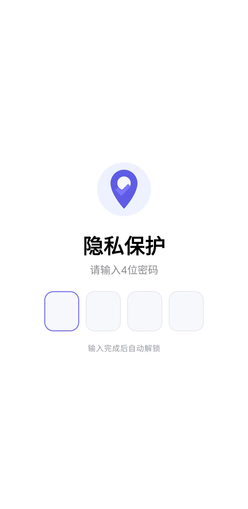
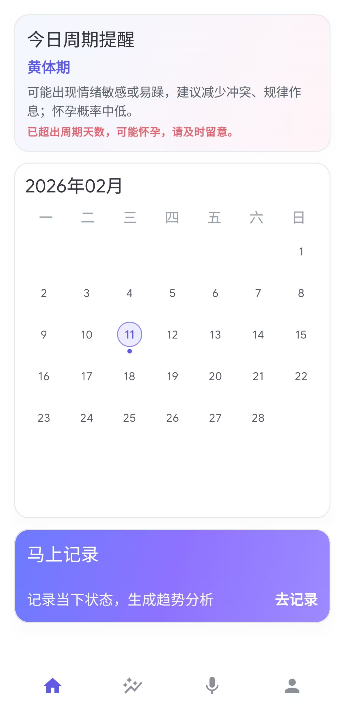
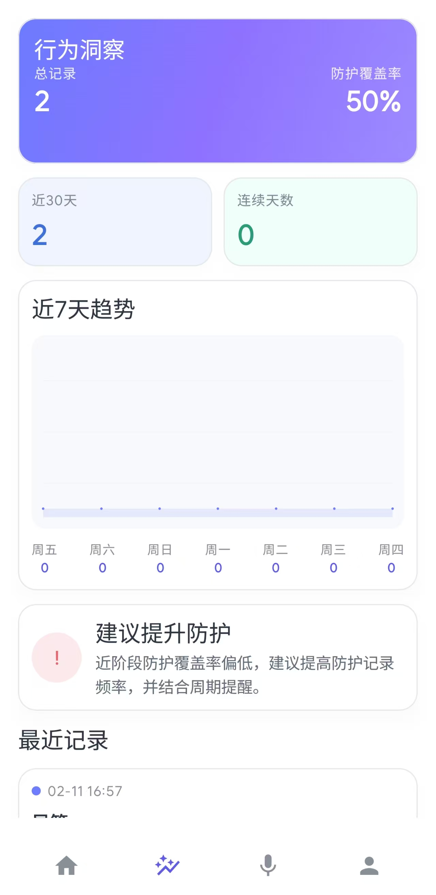
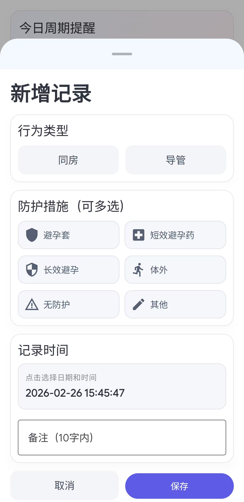
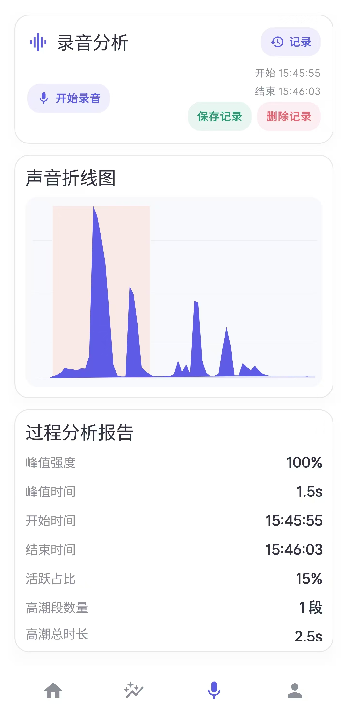
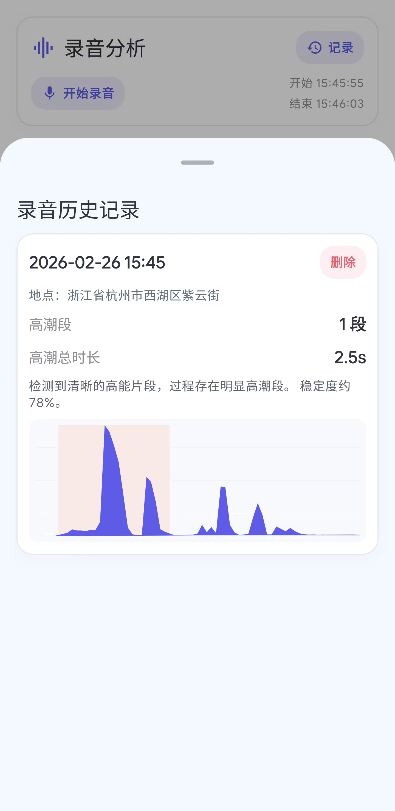
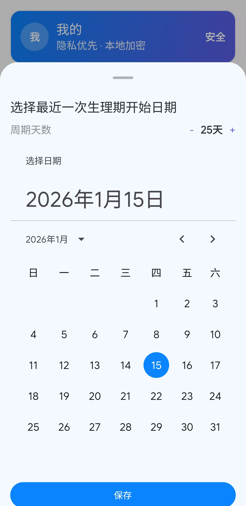

# 干了么 (GanLeMe) Android MVP

包含 P0 功能的可运行骨架：解锁、首页日历、记录面板、筛选、设置、详情；本地 SQLCipher + Room 加密存储；5 分钟后台自动锁；禁止截图。

# 项目所有内容均采用 MIT 许可证，详见 LICENSE 文件。

# 项目仍在积极开发中，欢迎star和提交PR，感谢！

# 转载请注明出处

# 项目截图

